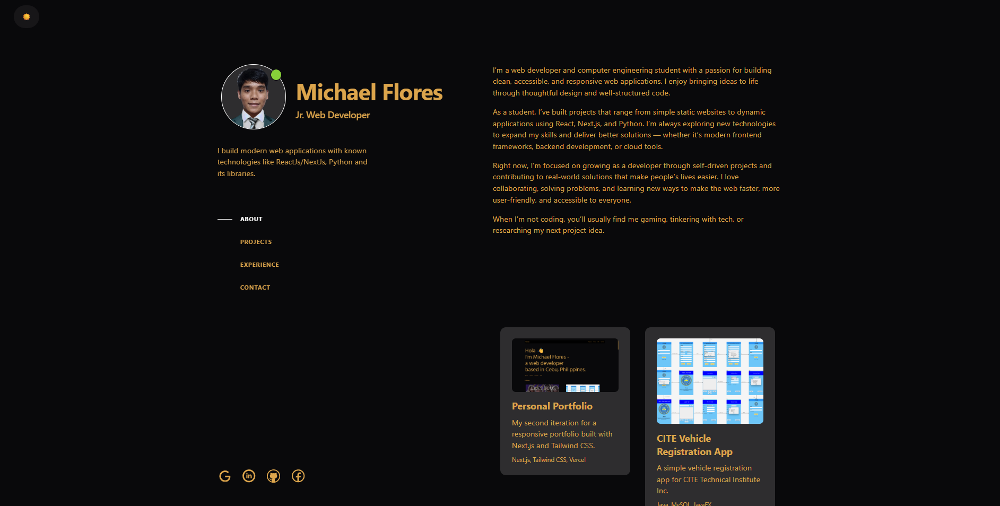
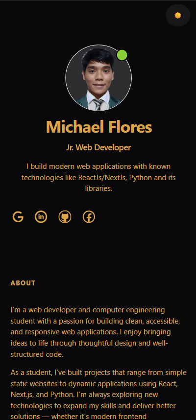

# Michael Flores - Personal Portfolio Website

## 📄 Description

This is my personal portfolio website showcasing my projects, skills, and experience.  
Built with **Next.js**, **Tailwind CSS**, **DaisyUI**, and deployed on **Vercel**.  
It features responsive design, animations with Framer Motion, and an integrated GitHub projects page.

p.s. This is inspired from Brittany Chiangs' Design

---

## 🚀 Technologies Used

- **Next.js** (React Framework)
- **Tailwind CSS** (Utility-first CSS)
- **DaisyUI** (Tailwind CSS Component Library)
- **Framer Motion** (Animations)
- **Vercel** (Deployment)

---

## ⚙️ Setup Instructions

The site is deployed and accessible online.
👉 [View Live Website](https://michaelflores.vercel.app)

If you want to run it locally:

1. **Clone the repository**

   ```bash
   git clone https://github.com/FloresTristan/personal_portfolio_website.git
   cd personal_portfolio_website
   npm install
   npm run dev

## 📸 Screenshots

### ✅ Desktop View


### ✅ Mobile View
